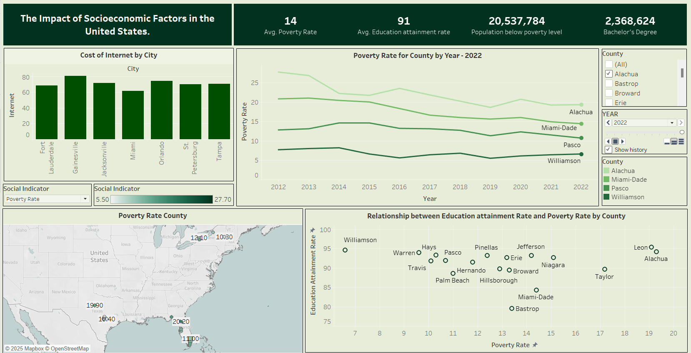
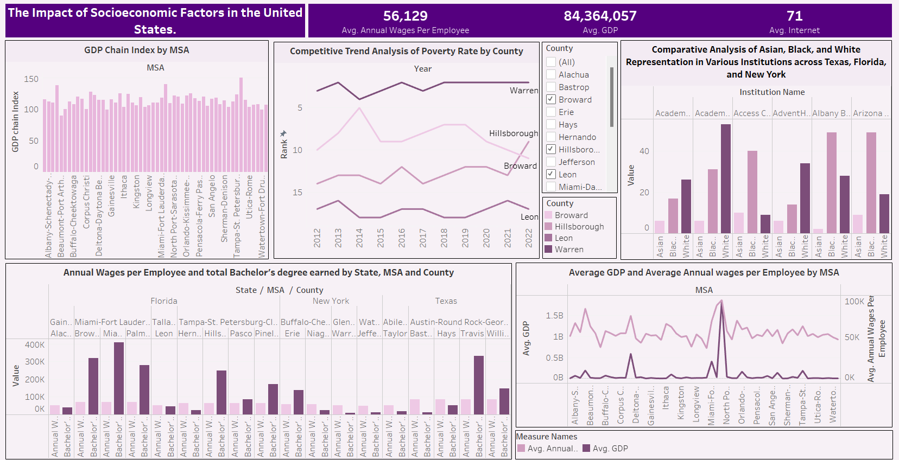

# Socioeconomic Data Visualization Project (Texas Florida New York)

## 📊 Overview

This Tableau based data visualization project explores how key socioeconomic factors—such as education, poverty, wages, internet costs, GDP, and ethnicity—interact within counties and Metropolitan Statistical Areas (MSAs) across Texas, Florida, and New York. 

The analysis addresses regional disparities, economic mobility, digital access, and institutional representation using nine visualizations and dashboards built from publicly available datasets.

## 📁 Files Included

- `DV_Project_SK.twbx`: Tableau Workbook with interactive dashboards
- `DV_Project_Report.docx`: Full project analysis and insights
- Dataset files:
  - `Annual_Wages_Per_Employee_Final.xlsx`
  - `Cost of Internet.csv`
  - `Datasets.xlsx`
  - `Education_Attainment.csv`
  - `Ethnicity and Race.csv`
  - `GDP.csv`
  - `poverty_Rate.csv`

## 🧠 Key Research Questions

- What is the relationship between education and poverty rates?
- How have poverty trends evolved over the past decade?
- How do internet costs affect digital equity across cities?
- What does the GDP Chain Index reveal about regional economies?
- How do annual wages and bachelor’s degrees correlate?
- What insights emerge from race and ethnicity representation in institutions?

## 📈 Dashboards

### 🔗 View Interactive Dashboards on Tableau Public

- **Social and Educational Insights**  
  [View Dashboard 1](https://public.tableau.com/app/profile/shweta.vinod.kulkarni2486/viz/ImpactofSocioeconomicFactorsintheUnitedStates/SocialandEducationalInsights)

- **Economic and Social Insights**  
  [View Dashboard 2](https://public.tableau.com/app/profile/shweta.vinod.kulkarni2486/viz/ImpactofSocioeconomicFactorsintheUnitedStates2/EconomicandSocialInsights)

### Dashboard 1: Education Poverty Internet and Demographics

This dashboard focuses on poverty rate trends (2012–2022), internet affordability by city, geographic poverty distribution, and the relationship between education attainment and poverty rate by county.

### Dashboard 2: GDP Wages and Representation Across Institutions

This dashboard visualizes GDP Chain Index by MSA, poverty rankings over time, racial representation in institutions, wage comparisons, and GDP vs. annual wages by MSA.

## 🛠 Data Sources

- **U.S. Census Bureau** – Education and Poverty data  
- **Bureau of Labor Statistics (BLS)** – Annual Wages  
- **Bureau of Economic Analysis (BEA)** – GDP and GDP Chain Index  
- **IPEDS** – Race and ethnicity in institutions  
- **Numbeo** – Internet cost data by city  

## 📌 Summary of Insights

- Counties with higher education attainment generally show lower poverty rates.
- Internet costs vary widely by city, impacting access and digital equity.
- Urban MSAs like New York and Miami lead in both GDP and wages.
- Ethnic representation across institutions reveals inclusion gaps.
- Economic trends vary significantly between rural and urban areas.

## 📚 Future Scope

- Explore how internet costs impact education and mobility
- Study GDP and education as mediators for poverty alleviation
- Extend analysis to rural vs. urban comparisons nationwide

## 👤 Author

**Shweta Vinod Kulkarni**  
Created using Tableau with publicly sourced datasets.

---

> Feel free to explore, fork, and contribute to the insights in this repository.
